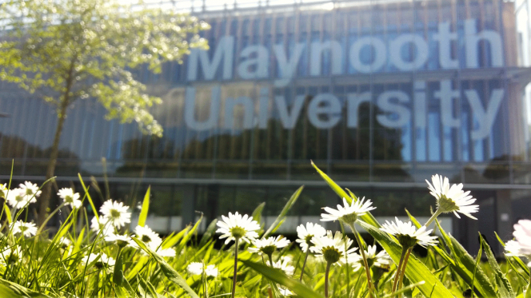

# Welcome to IMVIP 2026!

The **Irish Machine Vision and Image Processing (IMVIP) conference** (IMVIP 2026) will be hosted at [Maynooth University](https://www.maynoothuniversity.ie/), in Ireland:

- Venue details: [Maynooth campus](https://www.openstreetmap.org/#map=16/53.38206/-6.59762)
- Conference Dates: 26th to 28th August 2026 

## Important Dates:

- Paper submission deadline: TBC
- Notification of acceptance: TBC
- Camera ready paper deadline: TBC

## About IMVIP

The Irish Machine Vision and Image Processing (IMVIP) conference is the flagship event of the [Irish Pattern Recognition and Classification Society (IPRCS)](http://iprcs.org/). It provides a forum for researchers, practitioners, and students to present and discuss the latest advancements in machine vision, image processing, and related fields.

## Topics

Contributions are sought in all aspects of image processing, pattern analysis and machine vision, including but *not restricted to* the following topics:

- Image and Video Sensing, Representation, Modeling, and Registration
- Image and Video Filtering, Processing, Restoration, and Enhancement
- Motion Estimation, Registration, and Fusion
- Image and Video Analysis, Interpretation, and Understanding
- Image and Video Quality Models and Metrics
- Video Streaming and Content Delivery
- Visually Guided Robot Manipulation and Navigation
- Computer Vision for Autonomous Vehicles
- Augmented Reality/Virtual Reality
- Image & Video Representation, Compression - and Coding
- Medical and Biomedical Imaging
- Active Vision, Tracking and Motion Analysis
- Object and Event Recognition
- Face and Gesture Recognition
- 2D, 3D Scene Analysis and Visualisation
- Deep Learning for Computer Vision
- Audiovisual and Multimedia Systems
- Document Analysis and Processing
- Multi-Spectral Imaging and Applications
- Image/Shape Representation and Recovery

# Conference programme

TBD

## Submission Guidelines

Submissions will be peer-reviewed by at least two members of the program committee. Accepted papers will be published in the conference proceedings.

Submission via Easychair: url_TBC

#  Committees

Contact for enquiries: TBD 

## Organising Committee

- Prof. [John McDonald](https://www.maynoothuniversity.ie/computer-science/our-people/john-mcdonald)
- Prof. [Charles Markham](https://www.maynoothuniversity.ie/faculty-science-engineering/our-people/charles-markham)
- Prof. [Rozenn Dahyot](https://www.maynoothuniversity.ie/faculty-science-engineering/our-people/rozenn-dahyot)
- Prof. [Gerry Lacey](https://www.maynoothuniversity.ie/faculty-science-engineering/our-people/gerard-lacey) 

## Programme Committee

TBC
 
## History of the IMVIP conference

- [2025 IMVIP conference webpage](index-imvip2025.html)
- [Past IMVIP proceedings](https://iprcs.github.io/IMVIP.html)

[def]: Li