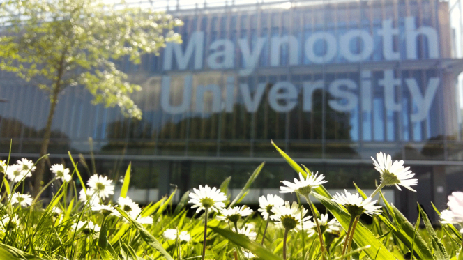

# Welcome to IMVIP 2026!

[Important Dates](https://imvipconference.github.io/#important-dates) | 
[Paper Submission](https://imvipconference.github.io/#submission-guidelines-for-authors) |
[Conference Program](https://imvipconference.github.io/#conference-program) |
[Committees](https://imvipconference.github.io/#committees) | 
[Registration](https://imvipconference.github.io/#registration) |
[IMVIP history](https://imvipconference.github.io/#history-of-the-imvip-conference)

The 28th **Irish Machine Vision and Image Processing (IMVIP) conference** (IMVIP 2026) will be hosted at [Maynooth University](https://www.maynoothuniversity.ie/), in Ireland:

- Venue details: [Maynooth campus](https://www.openstreetmap.org/#map=16/53.38206/-6.59762)
- Conference Dates: **26th to 28th August 2026** 

## Important Dates:

- Paper submission deadline: **15th May 2026**
- Notification of acceptance: 30th June 2026
- Camera ready paper deadline: 8th July 2026
- Early bird registration: before/on  10th July 2026
- Conference dates: 26-28th August 2026

## About IMVIP

The Irish Machine Vision and Image Processing (IMVIP) conference is the flagship event of the [Irish Pattern Recognition and Classification Society (IPRCS)](http://iprcs.org/). It provides a forum for researchers, practitioners, and students to present and discuss the latest advancements in machine vision, image processing, and related fields.

## Topics

Contributions are sought in all aspects of image processing, pattern analysis and machine vision, including but *not restricted to* the following topics:

- Image and Video Sensing, Representation, Modeling, and Registration
- Image and Video Filtering, Processing, Restoration, and Enhancement
- Motion Estimation, Registration, and Fusion
- Image and Video Analysis, Interpretation, and Understanding
- Image and Video Quality Models and Metrics
- Video Streaming and Content Delivery
- Visually Guided Robot Manipulation and Navigation
- Computer Vision for Autonomous Vehicles
- Augmented Reality/Virtual Reality
- Image & Video Representation, Compression - and Coding
- Medical and Biomedical Imaging
- Active Vision, Tracking and Motion Analysis
- Object and Event Recognition
- Face and Gesture Recognition
- 2D, 3D Scene Analysis and Visualisation
- Deep Learning for Computer Vision
- Audiovisual and Multimedia Systems
- Document Analysis and Processing
- Multi-Spectral Imaging and Applications
- Image/Shape Representation and Recovery

## Submission Guidelines for Authors

Two types of papers can be submitted to IMVIP:

- `Full Papers` must be a maximum of 8 pages including references and appendices.

- `Short papers` must be a maximum of 4 pages including references and appendices.

Submissions will be peer-reviewed by at least two members of the program committee. All accepted papers will be published in the conference proceedings.

Paper templates:

- [Latex Template](https://imvipconference.github.io/imvip_Formatting_Instructions.zip)

- [Paper MS Word  Template](https://imvipconference.github.io/imvip_Formatting_Instructions.docx)

Submission requirements:

- Papers are to be submitted in PDF format for blind review (submitted PDF papers should not allow to identify authors).

- Submitted PDF papers should be free of hidden messages or prompts. 

- Both submitting **authors** and **reviewers**  for IMVIP 2026 are requested to follow  [Guidelines for **Generative AI Usage**](https://www.ieee-ras.org/publications/guidelines-for-generative-ai-usage/) written by IEEE Robotics and Automation Society Website.

Submission system:

The CMT submission website will be open at URL_TBC (coming soon).  

The Microsoft CMT service was used for managing the peer-reviewing process for this conference. This service was provided for free by Microsoft and they bore all expenses, including costs for Azure cloud services as well as for software development and support.

# Conference program

## Keynote speakers

<table>
<tr>
<td></td>
<td> Our first confirmed Keynote at IMVIP 2026 is <a href="https://sonhua.github.io/">Prof. Binh-Son Hua</a> from Trinity College Dublin! Check out his amazing research in computer vision,  deep learning and computer graphics  on <a href="https://sonhua.github.io/">his website!</a>
</td>
</tr>
<tr>
<td></td>
<td>TBA</td>

</tr>
</table>

## Programme

The conference programme will be updated in early August, but in line with previous IMVIP conferences, we indicate below start/end day and time for the conference. 

- Wednesday 26th August 2026

    - 1:00-2:00 pm Conference registration

    - 2:00 pm Conference starts

-  Thursday 27th August 2026

- Friday 28th August 2026

    - 12:00pm  Conference end. 

# Registration

The registration fees includes annual membership to the IPRCS, IAPR and IFCS.
**Each registration covers one paper only (please enter paper number when registering).**

- Student registration (early bird registration/late registration): €TBD / €TBD

- Full registration (early bird registration/late registration): €TBD / €TBD

#  Committees

Contact for enquiries: `imvip-2026(at)mu.ie`

## Organising Committee

- Prof. [John McDonald](https://www.maynoothuniversity.ie/computer-science/our-people/john-mcdonald)
- Prof. [Charles Markham](https://www.maynoothuniversity.ie/faculty-science-engineering/our-people/charles-markham)
- Prof. [Rozenn Dahyot](https://www.maynoothuniversity.ie/faculty-science-engineering/our-people/rozenn-dahyot)
- Prof. [Gerry Lacey](https://www.maynoothuniversity.ie/faculty-science-engineering/our-people/gerard-lacey) 

## Programme Committee

TBC
 
## History of the IMVIP conference

- [IMVIP2025](index-imvip2025.html), [IMVIP 2024](https://sites.google.com/view/imvip2024/home), [IMVIP2023](https://www.universityofgalway.ie/c3i/news---events/imvip_2023/), ...
- [IMVIP proceedings](https://iprcs.github.io/IMVIP.html)
