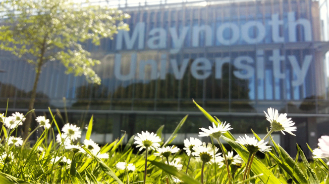

# Welcome to IMVIP 2026!

[Important Dates](https://imvipconference.github.io/#important-dates) | 
[Paper Submission](https://imvipconference.github.io/#submission-guidelines-for-authors) |
[Conference Program](https://imvipconference.github.io/#conference-program) |
[Registration](https://imvipconference.github.io/#registration) |
[Travel Bursaries](https://imvipconference.github.io/#travel-bursaries) |
[Accommodation](https://imvipconference.github.io/#accommodation) |
[Committees](https://imvipconference.github.io/#committees) | 
[Sponsors](https://imvipconference.github.io/#sponsors) | 
[IMVIP history](https://imvipconference.github.io/#history-of-the-imvip-conference)

The 28th **Irish Machine Vision and Image Processing (IMVIP) conference** (IMVIP 2026) will be hosted at [Maynooth University](https://www.maynoothuniversity.ie/), in Ireland:

- Conference Dates: **26th to 28th August 2026** 
- Venue details:
    - [Maynooth campus](https://www.openstreetmap.org/#map=16/53.38206/-6.59762) - see information [how to get there](https://www.maynoothuniversity.ie/international/getting-maynooth)
    - The conference will be held in room TSI039 of the TSI Building on the Maynooth University North Campus. A map of the building and room location is available at the following [link](IMVIP_2026_Map.pdf). The building is approximately 10 minutes walking distance from both the Glenroyal Hotel and the Maynooth Train Station.
    - Attendees may park in any of the on-campus car parks as zoned car-parking is not enforced during the conference.

## Important Dates:

- **Paper submission deadline extended: ~~15th May 2026~~ 4th June 2026 (Note this is a hard deadline for both long and short papers with no further extensions)**
- Notification of acceptance: ~~30th June 2026~~ 3rd July 2026
- Early bird registration: before/on  10th July 2026
- Camera ready paper deadline: **7th August 2026** (see [instructions](#camera-ready-papers))
- Conference dates: 26-28th August 2026

## About IMVIP

The Irish Machine Vision and Image Processing (IMVIP) conference is the flagship event of the [Irish Pattern Recognition and Classification Society (IPRCS)](http://iprcs.org/). It provides a forum for researchers, practitioners, and students to present and discuss the latest advancements in machine vision, image processing, and related fields.

## Topics

Contributions are sought in all aspects of image processing, pattern analysis and machine vision, including but *not restricted to* the following topics:

- Image and Video Sensing, Representation, Modeling, and Registration
- Image and Video Filtering, Processing, Restoration, and Enhancement
- Motion Estimation, Registration, and Fusion
- Image and Video Analysis, Interpretation, and Understanding
- Image and Video Quality Models and Metrics
- Video Streaming and Content Delivery
- Visually Guided Robot Manipulation and Navigation
- Computer Vision for Autonomous Vehicles
- Augmented Reality/Virtual Reality
- Image & Video Representation, Compression - and Coding
- Medical and Biomedical Imaging
- Active Vision, Tracking and Motion Analysis
- Object and Event Recognition
- Face and Gesture Recognition
- 2D, 3D Scene Analysis and Visualisation
- Deep Learning for Computer Vision
- Audiovisual and Multimedia Systems
- Document Analysis and Processing
- Multi-Spectral Imaging and Applications
- Image/Shape Representation and Recovery

## Submission Guidelines for Authors

Two types of papers can be submitted to IMVIP:

- `Full Papers` must be a maximum of 8 pages including references and appendices.

- `Short papers` must be a maximum of 4 pages including references and appendices.

Submissions will be peer-reviewed by at least two members of the program committee. All accepted papers will be published in the conference proceedings.

### Paper templates:

- [Latex Template](https://imvipconference.github.io/imvip_Formatting_Instructions.zip)

- [Paper MS Word  Template](https://imvipconference.github.io/imvip_Formatting_Instructions.docx)

### Submission requirements:

- Papers are to be submitted in PDF format for blind review (submitted PDF papers should not allow to identify authors).

- Submitted PDF papers should be free of hidden messages or prompts. 

- Both submitting **authors** and **reviewers**  for IMVIP 2026 are requested to follow  [Guidelines for **Generative AI Usage**](https://www.ieee-ras.org/publications/guidelines-for-generative-ai-usage/) written by IEEE Robotics and Automation Society Website.

### Submission system:

The CMT submission website is opened:  [CMT IMVIP](https://cmt3.research.microsoft.com/IMVIP2026/).  

The Microsoft CMT service was used for managing the peer-reviewing process for this conference. This service was provided for free by Microsoft and they bore all expenses, including costs for Azure cloud services as well as for software development and support.

### Camera Ready papers:

Authors of accepted papers are invited to  fully address the reviewers comments raised as well as possible in their camera ready papers. 

The AI statement is not required in the camera ready paper to save space.

### Paper Prizes 

As part of IMVIP 2026, the following paper prizes will be awarded:

- The Jon Campbell best paper Prize
- Best student paper prize

### Travel Bursaries

IMVIP 2026 is pleased to announce we have 4 travel bursaries to support student attendance at the conference. Please note you must have an accepted paper and be a registered student at a university or college to be eligible for this bursary. Note: Bursaries will be paid by bank transfer to awardees after the conference has taken place. These bursaries are sponsored by the [Irish Pattern and Classification Society](https://iprcs.github.io/). The bursaries on offer are 2x National bursaries to the value of €250 each and 2x International bursaries to the value of €500 each.

We are now accepting applications for bursaries via the following link: [IMVIP 2026 Travel Bursary Form](https://forms.microsoft.com/e/SUtYNbb24E). 

**The deadline for applications is 5pm Monday 27th July 2026. Final decisions on award recipients will be communicated in early August.** 

# Conference program
The full schedule, session details, and paper listings are now available:
**[View the Full IMVIP 2026 Programme](programme.html)**

- Wednesday 26th August 2026

    - 1:00-2:00 pm Conference registration

    - 2:00 pm Conference starts

-  Thursday 27th August 2026

- Friday 28th August 2026

    - 13:00pm  Conference end.
## Keynote speakers

<table>
<tr>
<td width="30%"></td>
<td> Our first confirmed Keynote at IMVIP 2026 is <a href="https://sonhua.github.io/" target="_blank">Prof. Binh-Son Hua</a> from Trinity College Dublin! Check out his amazing research in computer vision,  deep learning and computer graphics  on <a href="https://sonhua.github.io/">his website!</a>
</td>
</tr>
<tr>
<td></td>
<td>Our second confirmed Keynote at IMVIP 2026 <a href="https://scholar.google.com/citations?user=356ahmwAAAAJ" target="_blank">Prof. Ganesh Sistu</a> 
Principal AI Architect in Valeo Ireland, and Adjunct Assistant Professor at the University of Limerick.
 
 
 Ganesh Sistu is leading multiple global research teams focusing on automated driving and parking at Valeo Ireland.
 With over 15 years of experience in computer vision and machine learning, he has contributed to 40+ publications in top-tier conferences such as ICCV, ICRA, and WACV, garnering over 2,000 citations and 30+ US and EU patent filings. He also plays a pivotal role in guiding the future of AI education as an Adjunct Assistant Professor at the University of Limerick and as an industry board member for Research Ireland's Data Science PhD and the National MSc in AI programs at the University of Limerick, blending academic insight with industry expertise.

</td>

</tr>
</table>

## Guidelines for Presenters:

All oral presentations for contributed papers will be scheduled within the individual oral sessions, and allotted a time of 20 minutes consisting of 15 minutes for the paper presentation and 5 minutes for questions.

Poster presenters will be provided with a single **portrait** A0 poster panel during the poster session. Given that the poster panels are A0 portrait format, if posters are in landscape format they will need to be no larger than A1 in size. Presenters should print their poster in advance of the conference and bring it with them on the day, as there will be **no poster printing facility available on site**.

If you have any questions on any of the above please get in touch by email: [imvip-2026@mu.ie](mailto:imvip-2026@mu.ie)

# Registration

The registration fees includes annual membership to the IPRCS, IAPR and IFCS.
**Each registration covers one paper only (please enter paper number when registering).**

- Student registration (early bird registration/late registration): €170 / €200

- Full registration (early bird registration/late registration): €225 / €250

**Early bird registration applies to registrations on or before 10th July 2026.**

**Register here:** [registration website](https://shop.maynoothuniversity.ie/product/imvip-2026-conference/)

# Accommodation
Accommodation options are available both on-campus at Maynooth University and at the Glenroyal Hotel (located at a short walk from the campus).

For on-campus accommodation please visit: [https://booking.maynoothcampus.com/](https://booking.maynoothcampus.com/).

To book accommodation with the Glenroyal hotel please visit: [https://www.glenroyal.ie/](https://www.glenroyal.ie/). Please note, to avail of conference rates please use the voucher code **CONF26** when booking.   

#  Committees

Contact for enquiries: `imvip-2026(at)mu.ie`

## Organising Committee

- Prof. [John McDonald](https://www.maynoothuniversity.ie/computer-science/our-people/john-mcdonald)
- Prof. [Charles Markham](https://www.maynoothuniversity.ie/faculty-science-engineering/our-people/charles-markham)
- Prof. [Rozenn Dahyot](https://www.maynoothuniversity.ie/faculty-science-engineering/our-people/rozenn-dahyot)
- Prof. [Gerry Lacey](https://www.maynoothuniversity.ie/faculty-science-engineering/our-people/gerard-lacey) 

## Programme Committee

- Aidan		Murphy,	University College Dublin
- Brian		Mac Namee,	University College Dublin 
- Bryan		Scotney,	Ulster University
- Derek		Molloy,	Dublin City University
- Dermot		Kerr,	Ulster University
- Francois		Pitie,	Trinity College Dublin
- Ganesh		Sistu,	Valeo Vision Systems
- George		Moore,	Ulster University
- Hideo		Saito,	Keio University
- Jane		Courtney,	TU Dublin
- John		McDonald,	Maynooth University
- Katterine 	N	Rios Peralta,	University College Dublin
- Kislay		Raj,	Dublin City University
- Mark		Halton,	University of Limerick
- Michael		Manzke,	Trinity College Dublin
- Michael		Schukat,	University of Galway
- Niall		McLaughlin,	Queen's University Belfast
- Richard		Gault,	Queen's University, Belfast
- Roshan		George,	University of Galway
- Rozenn		Dahyot,	Maynooth University
- Ruairi­	D	O'Reilly,	Cork Institute of Technology
- Sean		Mullery,	Atlantic Technological University
- Shane		Gilroy,	Atlantic Technological University
- Sonya		Coleman,	School of Computing and Intelligent Systems, University of Ulster
- Soumyabrata		Dev,	University College Dublin
- Tony		Scanlan,	University of Limerick
- Victoria	M.A.	Porter,	Queen's University, Belfast
- Vladimir		Krylov,	Dublin City University
- Zi		Ye,	Maynooth University

## Sponsors

 
## History of the IMVIP conference

- [IMVIP2025](index-imvip2025.html), [IMVIP 2024](https://sites.google.com/view/imvip2024/home), [IMVIP2023](https://www.universityofgalway.ie/c3i/news---events/imvip_2023/), ...
- [IMVIP proceedings](https://iprcs.github.io/IMVIP.html)
